# 🍔 QuickBite – Food Delivery App

Mini GrabFood/UberEats: người dùng có thể duyệt nhà hàng, chọn món, đặt hàng và theo dõi đơn theo thời gian thực.
Built with **NestJS + PostgreSQL** (backend) and **React Native (Expo)** (frontend)

## 📦 Tech Stack

### Frontend (Expo React Native)

- Expo + Expo Router (navigation)
- React Native Paper (UI kit)
- Context API (Auth, Cart)
- Axios + @tanstack/react-query (API fetch + cache)
- react-hook-form + zod (form validation)
- expo-location (location user)

### Backend (NestJS)

- NestJS + TypeORM + PostgreSQL
- JWT Authentication (Access + Refresh)
- Passport-JWT
- class-validator + class-transformer (DTO validation)
- @nestjs/config (.env management)
- @nestjs/swagger (API docs)
- redis (cache, lưu refresh_token)

---

## ⚡ Features

- **Auth**: Đăng ký, đăng nhập bằng JWT, phân quyền theo role
- **Restaurants**: CRUD + menu items, hiển thị theo khoảng cách đến user
- **Cart**: Thêm món, tính tổng
- **Orders**: Tạo đơn, xem lịch sử
- **Tracking**: Nhận status update qua WebSocket
- **Profile**: Thông tin + lịch sử đơn
- **Role**: Admin, User

---

## 🚀 Getting Started

### 1. Clone repo

```bash
git clone https://github.com/hangduchuy/quickbite.git
cd quickbite
```

### Backend

node 22.18.0

```bash
cd Backend
yarn install
yarn start:dev
```

### Frontend

```bash
cd Frontend
yarn install
yarn start
```

### Database

docker-compose up -d

## 📖 API Docs

http://localhost:3000/docs

### Screenshot flow

## 🚀 User Flow

[Login]  
Đăng nhập có User và Admin  
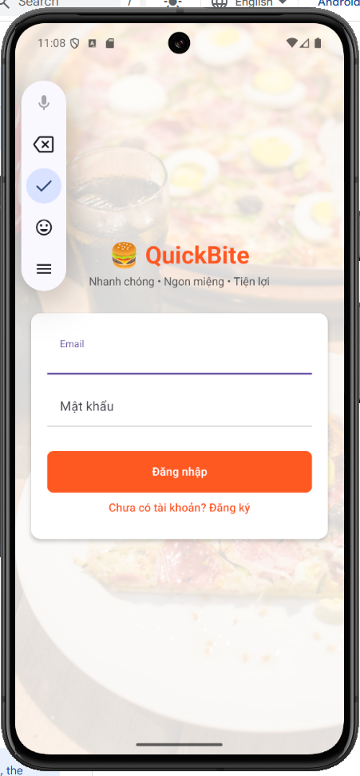

↓

[Home Screen User]

- Vào xin cấp quyền lấy vị trí người dùng để tính (khoảng cách, thời gian) di chuyển trên Map đến nhà hàng
- Search
- Danh sách các nhà hàng gần đó
- Categories (Pizza, Sushi, Drinks)  
  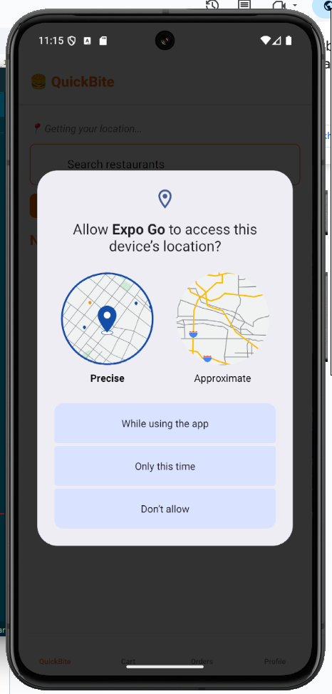  
  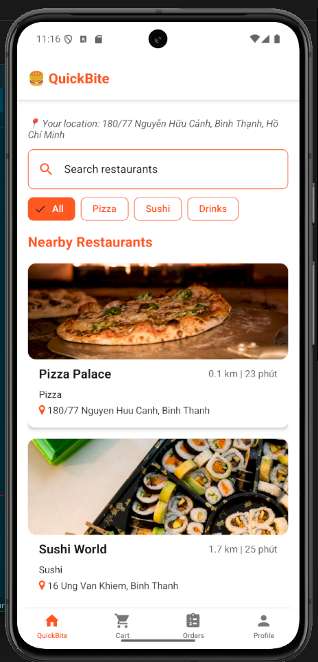

↓

[Restaurant Details]

- Khi nhấn vào view cart chuyển sang Cart  
  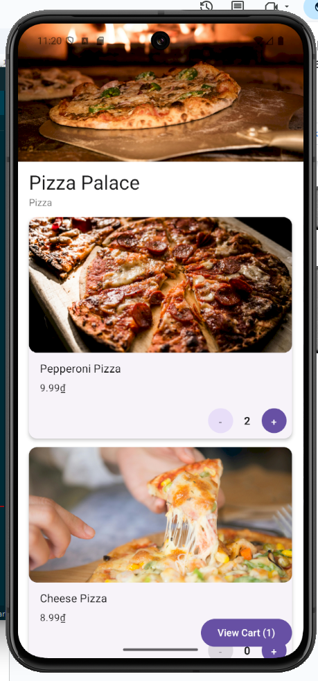

↓

[Cart Screen]

- Danh sách các mục đã chọn
- Checkout button  
  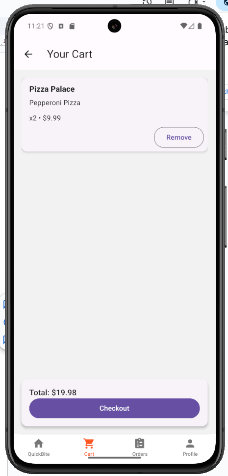

↓

[Order Tracking]  
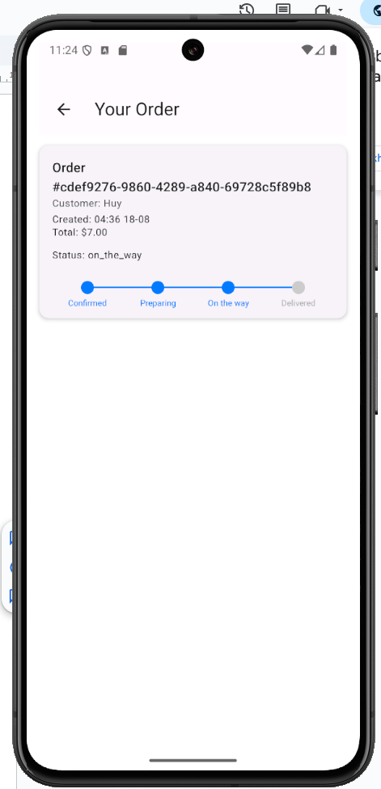

↓

[Order History]  
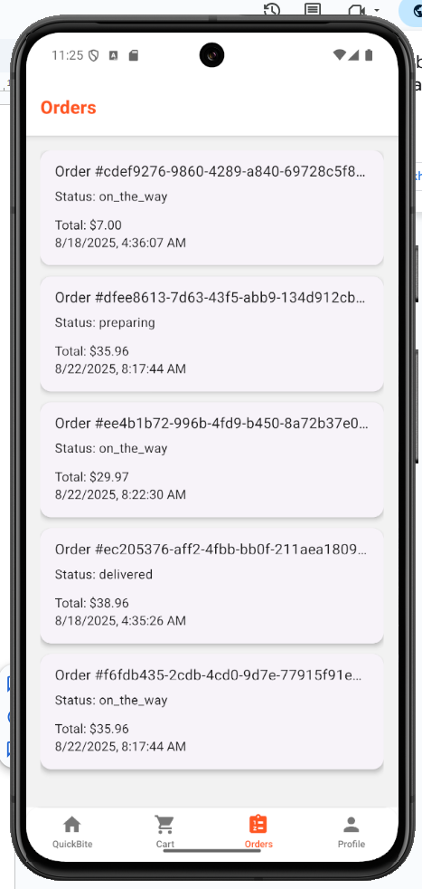

↓

[Profile Screen]  
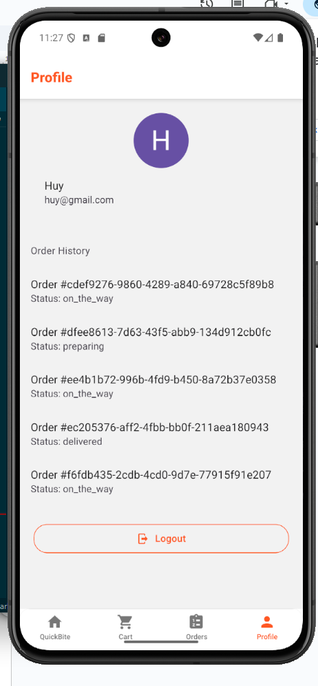

---

## 🛠️ Admin Flow

[DashBoard Screen]  
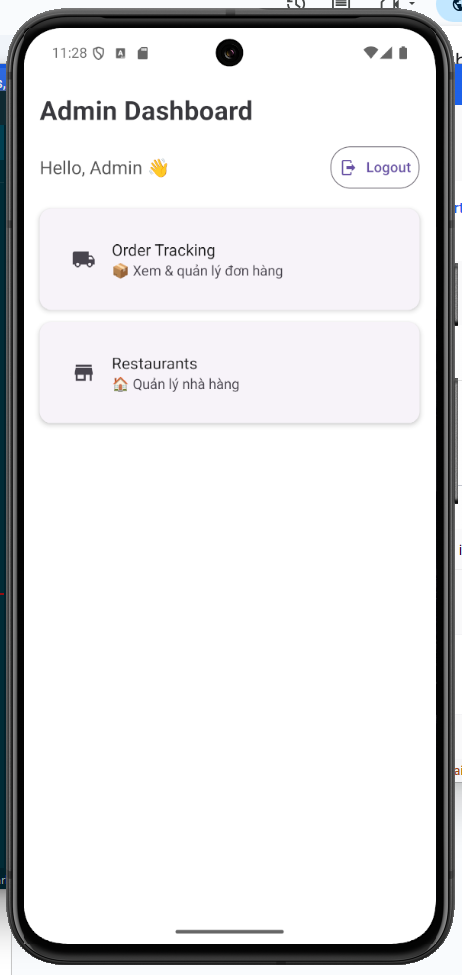

↓

[Quản lý đơn hàng]

- search Order ID
- update status
- refresh data  
  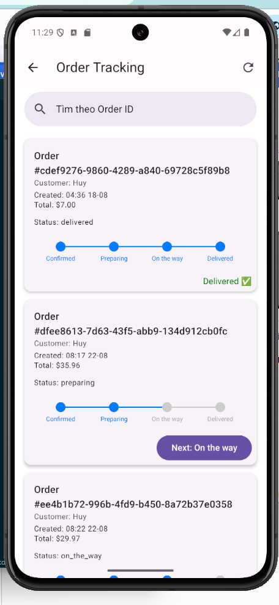

↓

[Quản lý nhà hàng]  
CRUD nhà hàng

- Thêm, sửa dùng chung modal
- Xoá thì thêm alert để xác nhận lần nữa
- Khi nhấn vào nhà hàng sẽ di chuyển đến menu nhà hàng đó  
  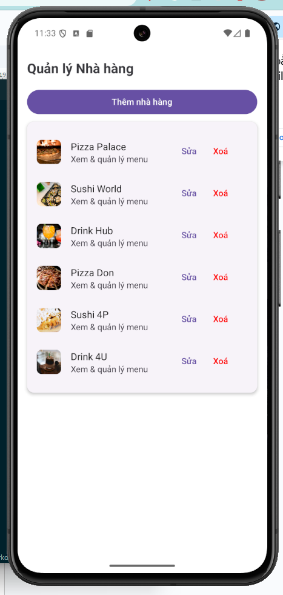  
  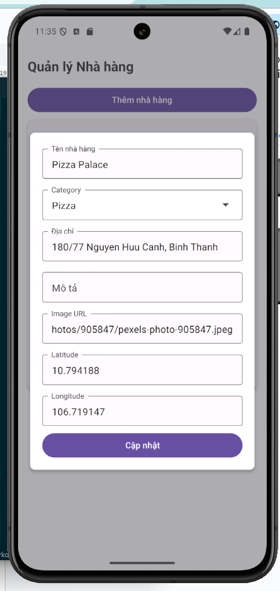

↓

[Quản lý Menu của nhà hàng]  
CRUD Tương tự như nhà hàng  
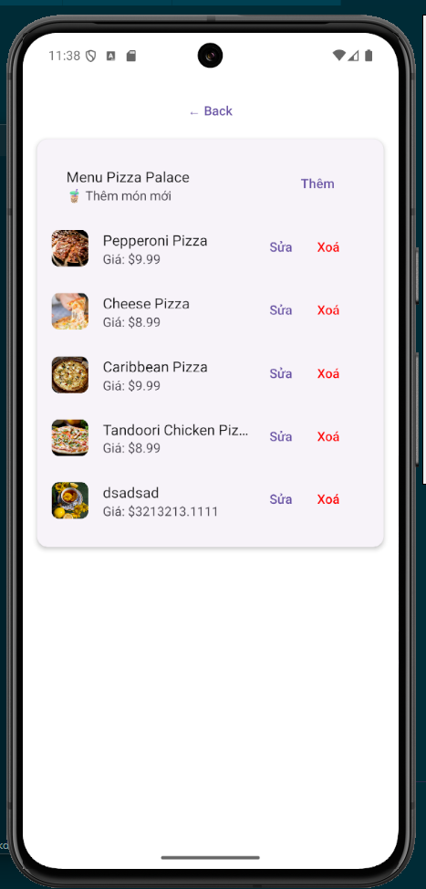  
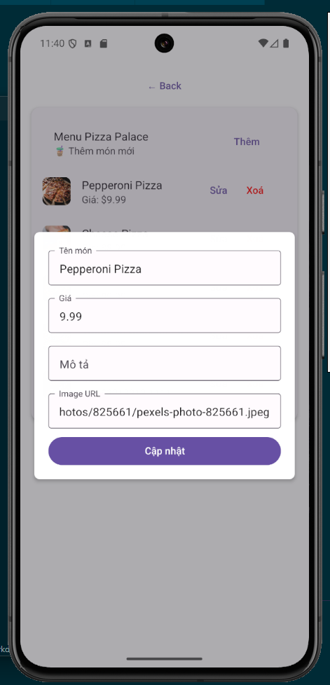
